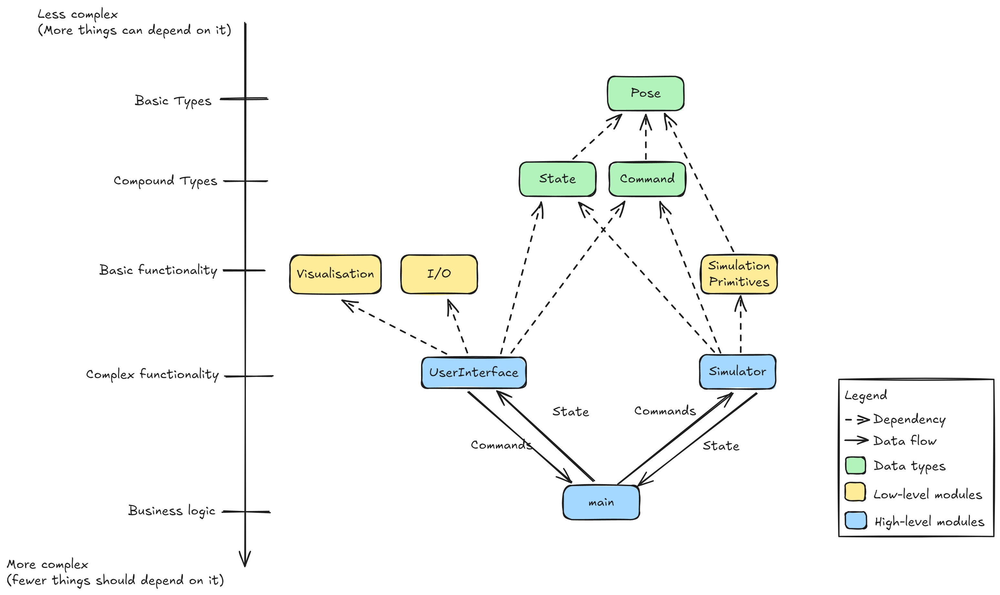

### Overview

`co_toy_robot_simulator` implements a very (very) basic planar robot simulator. It comprises a robot that can only face in four directions (`NORTH`, `SOUTH`, `EAST`, `WEST`), and take a small, discrete set of commands (`MOVE`, `RIGHT`, `LEFT`).

The simulator can also be told to `PLACE` the robot and `REPORT` on its status.

The code is structured as follows (more detail on the rational down on the Architecture section):



### Usage

Simply run

```
python main.py
```

to run through a few hard-coded commands, or run

```
python main.py --live
```

to run an interactive session with the simulator. To exit, use `ctrl+c`.

An example interactive session would look something like this:

```
python .\main.py --live
Input your command: PLACE 0,0,NORTH
Input your command: REPORT
0,0,Direction.NORTH
Input your command: MOVE
Input your command: MOVE
Input your command: MOVE
Input your command: REPORT
0,3,Direction.NORTH
Input your command: RIGHT
Input your command: REPORT
0,3,Direction.EAST
Input your command: MOVE
Input your command: MOVE
Input your command: MOVE
Input your command: REPORT
3,3,Direction.EAST
```

Naturally, the simulator rejects commands that would drive the robot out of bounds:

```
python .\main.py --live
Input your command: PLACE 0,0,NORTH
Input your command: MOVE
Input your command: MOVE
Input your command: MOVE
Input your command: MOVE
Input your command: MOVE
WARNING:simulator:Latest command would lead to inadmissible state, so it has been ignored.
Input your command: REPORT
0,4,Direction.NORTH
```

or even place it out of bounds:

```
python .\main.py --live
Input your command: PLACE 10,10,NORTH
WARNING:simulator:Latest command would lead to inadmissible state, so it has been ignored.
```

To run the unit tests, simply run

```
pytest
```

at the root of the project. It should automagically find all of the unit tests under `test/`.


### Architecture

Seeing as this is still a challenge, I feel like I should elaborate on the design principles.

* **Typical Simulator Interface Structure**: Simulators "usually" follow a structure of this kind, where the simulator itself is separate from whatever interface it needs to interact with, and simply manages the state of the world and of the robot. Simulation then occurs in discrete steps, in this case governed by commands being input into the simulator. This allows for optimal decoupling between simulation logic, user interface logic, etc, so that each of these modules can be re-used or replaced as needed.
* **Unidirectional Dependencies**: Modules are allowed to depend in the direction from most to least complex. Naturally, many modules depend on trivial data types (which is okay), and fewer depend on more complex functionality, as the system is built from least to most complex.
* **Encapsulation**: Functionality does not leak between modules. The `Simulator` class is responsible for (and abstracts away) all simulator functionality, the `Command` class holds all of the related functionality, the `UserInterface` hides all I/O from the rest of the system, and so on.
* **Extensibility**: This is obviously a toy problem meant to be solved in relatively litte time, but my main concern with the overall architecture was to make sure it was extensible. It should be possible to add to this structure without having to refactor any of it or having to change any of these guiding principles. I can think of a few extensions:
    * **Better visualisation**: Consoles are great, but a little matplotlib plugged into `UserInterface` could easily show us where the robot is; `UserInterface` already knows the current state of the system at all times, so it could simply update a visualisation when its internal state is updated.
    * **Actual robot smarts**: The entirety of robot control is taken over by the `UserInterface`, but the use of the Command design pattern (and the `Command` type) would easily allow us to replace the `UserInterface` with, say, a path planning algorithm that tried to reach a target.
    * **Better simulation**: The `Simulator` only handles the state of the robot itself (and thus the `State` class is very small) but it could keep track of the position of obstacles in the scene, for instance. These could easily be added to `State` and the `Simulator`'s internals.
    * **Partial observability**: The `Simulator` currently outputs the entirety of its state when requested, but we could extend it (within this structure) to instead output noisy or incomplete data, to allow us to develop better planning algorithms against it.
    * **Dynamics**: Using exactly this architecture, we could extend the `Simulator` to keep track of dynamic state (robot velocity, etc) in discrete time steps, which would make it possible to use it to support very rudimentary trajectory planning.